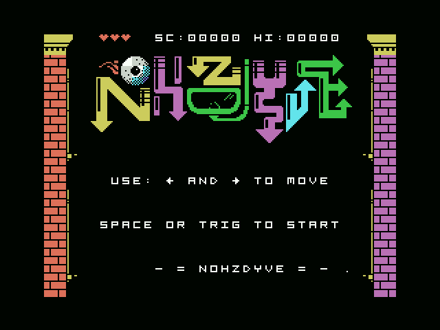
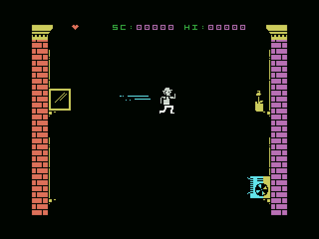
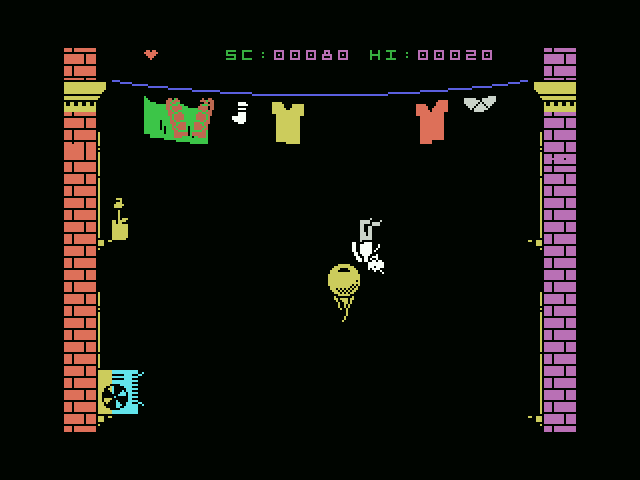

Nohzdyve for MSX 
===
Copyright 2019, Giovanni Nunes

Licensed under [GPL 3.0](LICENSE).

# Introduction
This is a MSX version for the speccy game [Nohzdyve](https://tuckersoft.net/ealing20541/nohzdyve/) written by Matt Wescott and released as an _Easter Egg_ for **Bandersnatch** episode of [Black Mirror](https://www.netflix.com/br-en/title/70264888) that I've created for scratch to answer my own question: _"Can I write games (for MSX) using something like MVC architecture?"_

Well, this game is the answer... :smiley:

# About the game
Quoting **Tuckersoft** "tribute" page:

> You're falling fast through the sky! Collect eyeballs and
> avoid the buildings and other hazards. Perfection is key.
> This was truly a five star game by none other than Colin
> Ritman.

And that's it...

# How to build
You need to install **GNU Make**, **Pasmo** and **Python 3.x**. Optionally you can install **OpenMSX** with **C-BIOS** too but isn't mandatory.

Enter on source code directory (`cd ./src`) and use `make bin` to create a binary file, `make rom` to generate a ROM file or `make all` to create both executables.

# How to play
There are pre built versions (take a look at "releases") for both binary and **ROM** formats. Download the format that you want and transfer it to your **MSX**. This game requires a computer with at least 16 KiB of **RAM** and works fine on both 50Hz and 60Hz models.

You can use keyboard or joystick at port \#1 to play.

# Screenshots

#### Opening Screen

#### Starting to fall

#### In game action

#### Game Over!

# Toolbox
I've used the following tools to write this game:
- [Atom](https://www.atom.io) and [Vim](https://www.vim.org) to edit code.
- [Gimp](https://www.gimp.org), [MSX Screen Converter](http://msx.jannone.org/conv/) and [Tiny Sprite](http://msx.jannone.org/tinysprite/tinysprite.html) for graphics.
- [Pasmo](https://pasmo.speccy.org/) to build code.
- [OpenMSX](http://openmsx.org/) (with [C-BIOS](http://cbios.sourceforge.net/)) to test.
- [Git](https://www.git-scm.org) to keep tracking of changes.
- [Python](https://www.python.org/) and sometimes [MSX-BASIC](https://en.wikipedia.org/wiki/MSX_BASIC) to build small data conversion tools.
